# ⸻📖目錄📑⸻ {.unnumbered}
* 🤗序言 〜  🙩 [《框智格局：人工智慧知行鷹架手冊》](index.zh-hant.md)
* 💬導論 ~  [❝腦補❞ 知行捷徑](notes-mental_fill-in.zh-hant.md)
* 📑筆記 ~  [🙶補全🙷 知行合一](notes-constructive_fill-in.zh-hant)
* [第壹篇 ㉄](01----problematics.zh-hant.md)　AI 問題意識（AI Problematics）
	* **1.1** 🎭🗪 [圖靈測試](01-01-Turing_Test.zh-hant.md)（Turing Test）
	* **1.2** 🧱🗣️ [中文房間](01-02-Chinese_Room.zh-hant.md)（Chinese Room）
	* **1.3** 🔤⚓ [符碼紮根問題](01-03-Symbol_Grounding_Problem.zh-hant.md)（Symbol Grounding Problem）
	* **1.4** 🖼️⏱️ [框架問題](01-04-Frame_Problem.zh-hant.md)（Frame Problem）
	* **1.5** 👁️⯊ [完形心理](01-05-Gestalt_Psychology.zh-hant.md)（Gestalt Psychology）
	* **1.6** 🎯🛡️ [對齊與控制問題](01-06-Alignment_Control_Problem.zh-hant.md)（AI Alignment & Control Problem）
	* **1.7** 🗫🎲 [語言賽局](01-07-Language_Games.zh-hant.md)（Language Games）
* [第貳篇 🎏🏮](02----schools_paradigms.zh-hant.md)　流派與主義（Schools & Paradigms）
	* **2.1** 🎏🏛️ [符號流／邏輯主義](02-01-symbolic_ai.zh-hant.md)（Symbolic AI / Logicism）
	* **2.2** 🎏🌀 [統計流](02-02-statistical_ai.zh-hant.md)（Statistical AI）
	* **2.3** 🎏🧠 [神經－符號合流](02-03-neurosymbolic_ai.zh-hant.md)（Neuro-Symbolic AI）
	* **2.4** 🪙🫣 [AGI 人工通用智慧](02-04-agi.zh-hant.md)（AGI）
	* **2.5** 🏮🧬 [連結主義](02-05-connectionism.zh-hant.md)（Connectionism）
	* **2.6** 🏮💪 [行為主義](02-06-behaviorism.zh-hant.md)（Behaviorism）
	* **2.7** 😵‍💫🧞‍♀️ [大語言模型](02-07-large_language_models.zh-hant.md)（Large Language Models）
* [第參篇 🏛️](03----symbolic_ai.zh-hant.md)　「符號流」AI（Symbolic AI）
	* **3.1** 🏛️⊨∴ [形式邏輯](03-01-formal_logic.zh-hant.md)（Formal Logic）
	* **3.2** 🏛️🤖💬 [自動對話系統](03-02-automatic_dialogue_systems.zh-hant.md)（Automatic Dialogue Systems）
	* **3.3** 🏛️🎁🧠 [專家系統](03-03-expert_systems.zh-hant.md)（Expert Systems）
	* **3.4** 🏛️🛠️🏗️ [知識表徵](03-04-knowledge_representation.zh-hant.md)（Knowledge Representation）
	* **3.5** 🏛️🕸💡 [知識圖譜](03-05-knowledge_graph.zh-hant.md)（Knowledge Graphs）
	* **3.6** 🏛️🌐🔗 [語意網](03-06-semantic_web.zh-hant.md)（Semantic Web）
	* **3.7** 🏛️🌌🗺️ [本體論](03-07-ontology.zh-hant.md)（Ontology）
* [第肆篇 🌀](04----statistical_ai.zh-hant.md)　「統計流」AI（Statistical AI）
	* **4.1** 🌀🎲🌿 [機率性關聯](04-01-probabilistic_association.zh-hant.md)（Probabilistic Association）
	* **4.2** 🌀🧞‍♀️🗪 [LLM聊天機器人](04-02-llm_chatbots.zh-hant.md)（LLM-based Chatbots）
	* **4.3** 🌀🪢🧠 [神經網路](04-03-neural_networks.zh-hant.md)（Neural Networks）
	* **4.4** 🌀🛠️🤏 [特徵工程](04-04-feature_engineering.zh-hant.md)（Feature Engineering）
	* **4.5** 🌀🤖📦 [機器學習模型](04-05-machine_learning_models.zh-hant.md)（Machine Learning Models）
	* **4.6** 🌀🌐🔗 [大語言模型網組合](04-06-llm_webassembly.zh-hant.md)（LLM WebAssembly）
	* **4.7** 🌀🌌▦ [向量空間](04-07-vector_space.zh-hant.md)（Vector Space）
* [第伍篇 ☸](05----ai_orientations.zh-hant.md)　區分 AI 5 大導向（AI Orientations）
	* **5.1** ☸🎯 **[任務導向型](05-01-oriented_task.zh-hant.md)**（Task-oriented AI）
	* **5.2** ☸🛠 **[工具導向](05-02-oriented_tool.zh-hant.md)**（Tool-oriented AI）
	* **5.3** ☸🤖 **[智能體／代理人導向](05-03-oriented_agent.zh-hant.md)**（Agent-oriented AI）
	* **5.4** ☸🤝 **[協作導向／以人為本導向](05-04-oriented_collaborative.zh-hant.md)**（Collaborative AI / Human-Centered AI）
	* **5.5** ☸⚖️ **[治理導向](05-05-oriented_governance.zh-hant.md)**（Governance-oriented AI）
* [第陸篇 ❖](06----analytics_decisions.zh-hant.md)　分析與決策 6 點（Analytics & Decisions）
	* **6.1** 🟡😷🩺 [診斷型分析](06-01-analysis_diagnostic.zh-hant.md)（Diagnostic Analysis）
	* **6.2** 🟠🤠🔮 [預測型分析](06-02-analysis_predictive.zh-hant.md)（Predictive Analysis）
	* **6.3** 🔴🧐🧭 [指導型分析](06-03-analysis_prescriptive.zh-hant.md)（Prescriptive Analysis）
	* **6.4** 🔵🤓📘 [描述型分析](06-04-analysis_descriptive.zh-hant.md)（Descriptive Analysis）
	* **6.5** 🟣🙀🎨 [生成式 AI](06-05-analysis_generative.zh-hant.md)（Generative AI）
	* **6.6** 🔁😽🪄  [決策演算法](06-06-decision_making_algorithm.zh-hant.md)（Decision-making Algorithm）
* [第柒篇 🏆](07----game_ai.zh-hant.md)　「博弈派」AI（Game AI）
	* **7.1** 🏆🐭🗺️ [IEEE電子老鼠走迷宮](07-01-ieee_micromouse.zh-hant.md)（IEEE Micromouse）  
	* **7.2** 🏆🕹️👾 [Atari DQN](07-02-atari_dqn.zh-hant.md)（Atari DQN）  
	* **7.3** 🏆⚪⚫ [AlphaGo 圍棋](07-03-alphago.zh-hant.md)（AlphaGo）  
	* **7.4** 🏆🃏💰 [撲克 AI](07-04-poker_ai.zh-hant.md)（Libratus / Pluribus）  
	* **7.5** 🏆🧙‍♂🥷 [OpenAI Five](07-05-openai_five.zh-hant.md)（Dota 2）  
	* **7.6** 🏆🐺🧑‍🌾 [狼人殺 AI](07-06-werewolf_ai.zh-hant.md)（Werewolf AI）  
	* **7.7** 🏆🪖⚔️ [戰場模擬](07-07-battlefield_simulation.zh-hant.md)（Battlefield Simulation）
* [第捌篇 🦾](08----embodied_ai.zh-hant.md)　「具身派」AI（Embodied AI）
	* **8.1** 🦾🎬🔋 [機器人學與實體驅動](08-01-robotics_and_physical_actuation.zh-hant.md)（Robotics & Physical Actuation）
	* **8.2** 🦾📡🌡️ [感知與環境](08-02-perception_and_environment.zh-hant.md)（Perception & Environment）
	* **8.3** 🦾🔄🖼️ [自適應機器人](08-03-adaptive_robotics.zh-hant.md)（Adaptive Robotics）
	* **8.4** 🦾🤝💪 [人機互動](08-04-human_robot_interaction.zh-hant.md)（Human-Robot Interaction, HRI）
	* **8.5** 🦾🛡️🚨 [機器人安全與穩健性](08-05-robot_safety_and_robustness.zh-hant.md)（Robot Safety & Robustness）
	* **8.6** 🦾🧭🎯 [任務與目標規劃](08-06-robot_tasks_and_goals.zh-hant.md)（Task & Goal Planning）
* [第玖篇 📐](09----ai_math.zh-hant.md)　AI用到的數學（Maths for AI）
	* **9.1** 🤝🚿 [協同過濾](09-01-collaborative_filtering.zh-hant.md)（Collaborative Filtering）
	* **9.2** 📉⛰️ [最陡下降法](09-02-steepest_descent_method.zh-hant.md)（Steepest Descent Method）
	* **9.3** 🔮🕸️ [貝氏網路](09-03-bayesian_network.zh-hant.md)（Bayesian Network）
	* **9.4** 🧹🧩 [稀疏建模](09-04-sparse_modeling.zh-hant.md)（Sparse Modeling）
	* **9.5** ⛓️🔄 [馬可夫模型](09-05-markov_modeling.zh-hant.md)（Markov Modeling）
	* **9.6** 🌲🧭 [蒙地卡羅樹搜尋](09-06-monte_carlo_tree_search.zh-hant.md)（Monte Carlo Tree Search, MCTS）
	* **9.7** 🧠⚡ [赫布學習論](09-07-hebb_rule.zh-hant.md)（Hebb’s Rule）
	* **9.8** 🧮💰 [多智能體報酬矩陣](09-08-multi_agent_payoff_matrix.zh-hant.md)（Multi-Agent Payoff Matrix）
* [第拾篇 🌉](10----ai_engineering.zh-hant.md)　AI工程（AI Engineering）
	* **10.1** 🌉🔗🌐 [API與MCP](10-01-API_MCP.zh-hant.md)（API/MCP）
	* **10.2** 🌉🤖🚨 [智能體可靠性與評估](10-02-agent_reliability_evaluation.zh-hant.md)（Agent Reliability & Evaluation）
	* **10.3** 🌉❔📌 [提示工程](10-03-prompt_engineering.zh-hant.md)（Prompt Engineering）
	* **10.4** 🌉🔗📒 [知識驅動生成（RAG）](10-04-retrieval_augmented_generation.zh-hant.md)（Retrieval-Augmented Generation）
	* **10.5** 🌉🪟🧭 [脈絡工程](10-05-context_engineering.zh-hant.md)（Context Engineering） 
	* **10.6** 🎁🌱🚀 [AI 產品經理](10-06-AI_PM.zh-hant.md)（AI Product Management）
* 📚 [參考書目](references.zh-hant.qmd)
- **🔖附錄與筆記**：
	- A. 💪[行動](appendix-action.zh-hant.qmd)：「行動協奏」〜 聚焦 **動詞** 
	- B. 🧠[心智](appendix-brain.zh-hant.md)：「道智修行」〜 聚焦 **名詞** 
	* C. 🪜[能力](appendix-cognitive_capacity.zh-hant.md)：「建補鷹架」〜 聚焦 **名詞➕動詞** 
	* D. ⚙[API分類](appendix-MCP_API.zh-hant.md)
	* E. 本書🌌[心智圖](appendix-mindmap.zh-hant.qmd)
	* F. 📔 [封面封底書脊](cover_back.zh-hant.md)
	* G. 🔖[詞彙表](glossary.zh-hant.md)
		* 🧠 [心智能力](notes-constructive_fill-in.zh-hant.md) 🐸🐘🧘
		* 🧠🧞‍♀️ [〜語言賽局腦補機](notes-mental_fill-in.zh-hant.html)
		* 🪜👨‍👩‍👧‍👦 〜家長篇~傳承 appendix-cognitive_capacity.zh-hant.md#parents
		* 🪜🧘 〜自學篇~紥根 appendix-cognitive_capacity.zh-hant.md#learners

